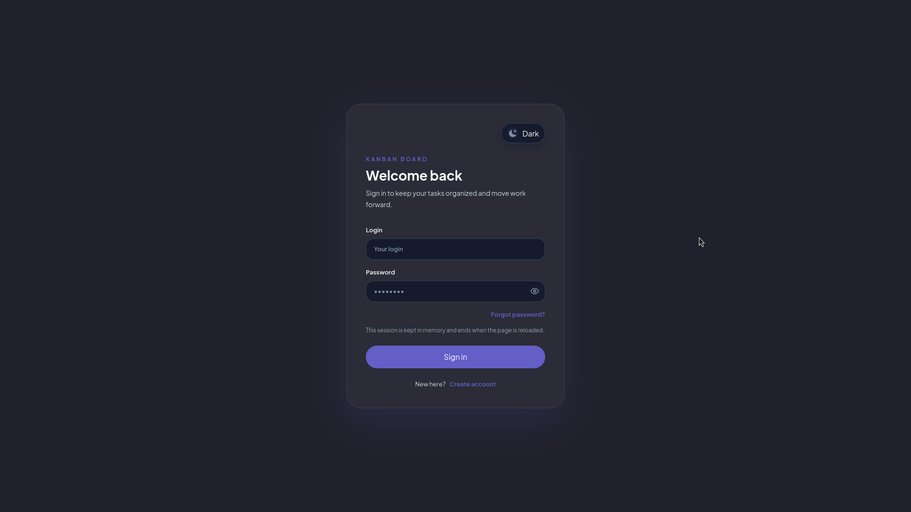
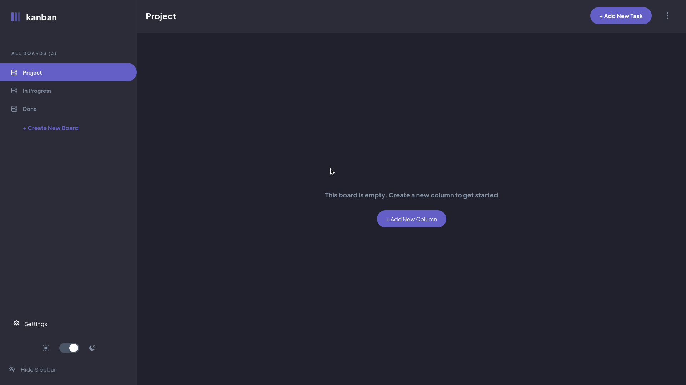
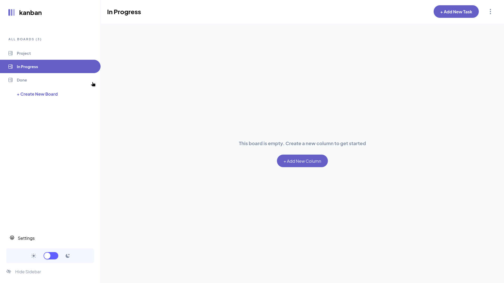
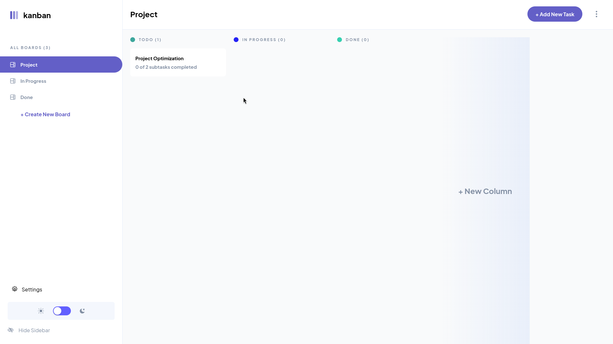
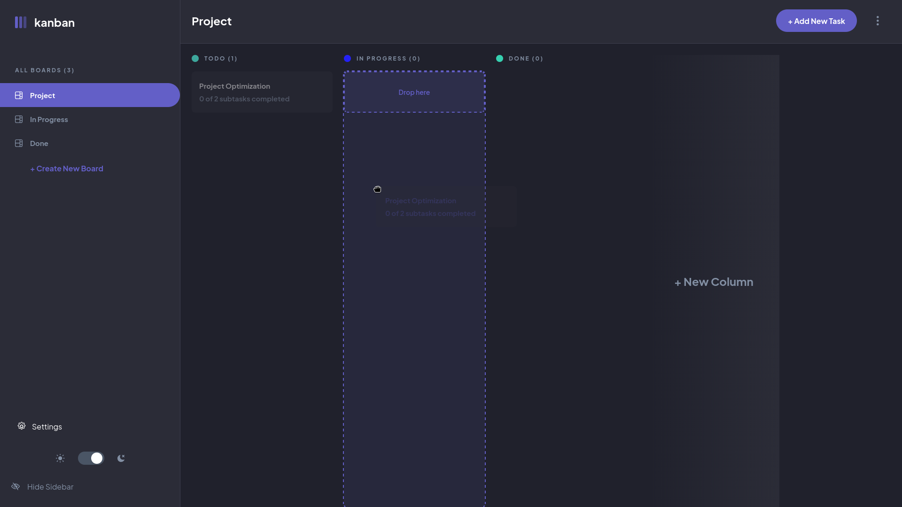
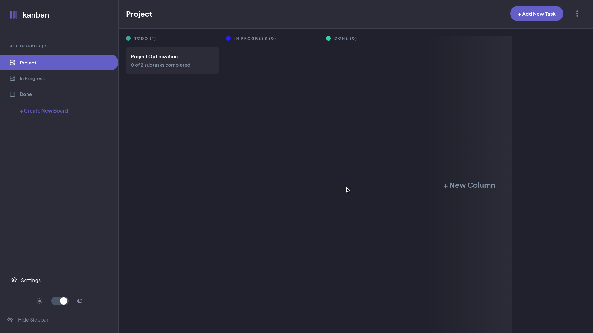
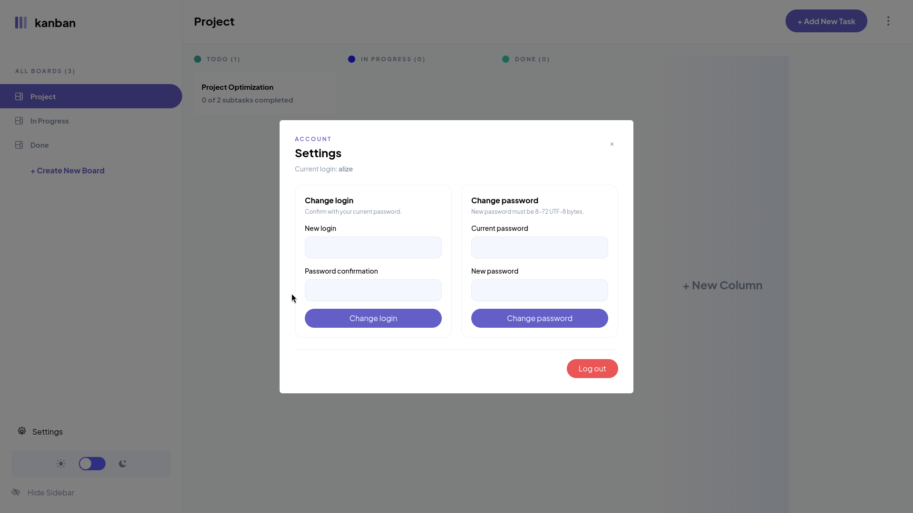
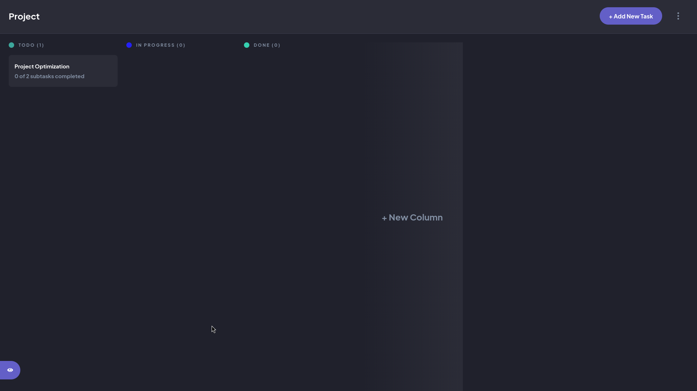
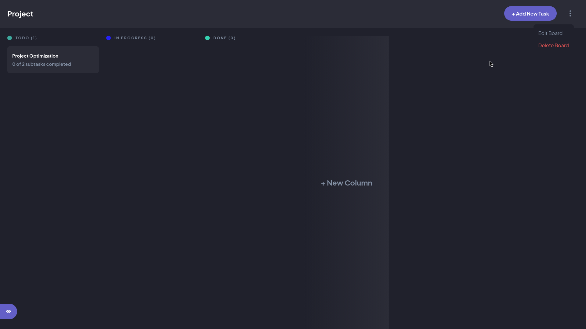

# Kanban Task Manager

A full-stack kanban board application with user authentication, task management, and drag-and-drop functionality. Built with React, Express, PostgreSQL, and TypeScript.

## Screenshots

<table>
  <tr>
    <td></td>
    <td></td>
  </tr>
  <tr>
    <td></td>
    <td></td>
  </tr>
</table>

<details>
  <summary>View more screenshots</summary>

  <br>

  <table>
    <tr>
      <td></td>
      <td></td>
    </tr>
    <tr>
      <td></td>
      <td></td>
    </tr>
    <tr>
      <td></td>
      <td></td>
    </tr>
  </table>

</details>

[Live Demo](https://alizewulf.github.io/kanban-task-manager-fullstack/)


## Features

### Authentication & Security
- **User Registration & Login**: JWT-based authentication with bcrypt password hashing
- **Protected Routes**: API endpoints require valid bearer token authentication
- **Ownership Verification**: Backend validates that users can only access their own boards, columns, categories, and tasks
- **Credential Management**: Users can update login credentials and passwords through account settings
- **Session Management**: Access tokens are stored in memory; users are logged out when tokens expire or become invalid
- **Password Hashing**: Passwords are hashed with bcrypt; legacy plaintext passwords are automatically upgraded on first login

### Board & Column Management
- **Create Boards**: Users can create multiple boards for organizing tasks
- **Edit Boards**: Update board titles and manage board-level settings
- **Delete Boards**: Remove boards and cascade-delete associated data
- **Column CRUD**: Create, rename, and delete columns within boards
- **Column Ordering**: Columns maintain position for consistent board layout

### Task Categories
- **Task Categories**: Organize tasks into categories (also called "swimlanes") within each column
- **Category Management**: Create, edit, and delete categories with automatic color assignment
- **Category Ordering**: Categories maintain position within their column
- **Cascade Deletion**: Deleting a category deletes all associated tasks at the database level

### Tasks
- **Create Tasks**: Add tasks to specific categories with titles and descriptions
- **Task Details Modal**: Dedicated interface for viewing and editing comprehensive task information
- **Edit Tasks**: Update task titles and descriptions
- **Delete Tasks**: Remove tasks with database cleanup
- **Task Descriptions**: Full-text descriptions for task context
- **Task Movement**: Move tasks between categories with drag-and-drop or API endpoints
- **Position Tracking**: Tasks maintain position within categories for consistent ordering

### Subtasks
- **Create Subtasks**: Break down tasks into smaller steps
- **Subtask Completion**: Mark subtasks as complete or incomplete
- **Edit & Delete**: Modify or remove subtasks from the task details modal
- **Completion Tracking**: Frontend displays subtask completion status

### Drag & Drop
- **Task Reordering**: Reorder tasks within and between categories using drag-and-drop
- **Visual Feedback**: Drop indicators show where tasks will be placed
- **Position Updates**: Task positions are persisted to the backend after drops
- **Cross-Category Moves**: Tasks can be moved between categories with validation

### User Experience
- **Dark/Light Theme**: Toggle between dark and light modes with persistent preference
- **Loading States**: Skeleton loaders for boards and task data while fetching from the backend
- **Error Handling**: Clear error messages for failed operations with retry functionality
- **Responsive Layout**: Sidebar for board navigation collapsible on smaller screens
- **Password Visibility Toggle**: Show/hide passwords during login
- **Improved UX**: Dedicated account settings panel for credential management

## Tech Stack

### Frontend
- **React** 19 — UI framework
- **TypeScript** — Type safety
- **Vite** — Build tool and dev server
- **React Router** 8 — Client-side routing
- **Redux Toolkit** — State management for authentication and theme
- **Axios** — HTTP client for API communication
- **Tailwind CSS** — Utility-first CSS framework
- **Formik** — Form state management and validation
- **Zod** — Schema validation
- **React Loading Skeleton** — Loading placeholder UI

### Backend
- **Node.js** — JavaScript runtime
- **Express** 5 — HTTP server framework
- **TypeScript** — Type safety
- **PostgreSQL** — Relational database
- **pg** — PostgreSQL client for Node.js
- **JWT (jsonwebtoken)** — Token-based authentication
- **bcrypt** — Password hashing
- **CORS** — Cross-origin resource sharing

### Database
- **PostgreSQL** — Production-grade relational database

## Architecture

The application is built as a separated frontend and backend:

```
Frontend (React + Vite)
      ↓ HTTP/REST API
Backend (Express + Node.js)
      ↓ SQL Queries
Database (PostgreSQL)
```

### Frontend Architecture

```
frontend/src/
  app/              # Application root and routing
  entities/         # Domain models and types
  features/         # Feature-specific components and logic
  pages/            # Page-level components
  shared/           # Shared utilities, API client, theme, UI components
  store/            # Redux store and slices
  widgets/          # Reusable composite components
```

**Key patterns:**
- **API Client Layer** (`shared/api`): Centralized Axios configuration with automatic JWT token injection and authentication error handling
- **State Management**: Redux Toolkit for authentication state; React Context for board loading state and errors
- **Protected Routes**: Redirect unauthenticated users to login
- **Service Layer**: Business logic separated from components

### Backend Architecture

```
backend/src/
  config/           # Configuration and environment setup
  database/         # PostgreSQL connection and schema
    └─ schema/      # SQL schema definitions
  global/           # Global utilities and types
  modules/          # Feature-specific logic
    ├─ auth/        # Authentication, JWT, ownership checks
    ├─ columns/     # Board column management
    ├─ tasks/       # Task CRUD and movement
    ├─ task_categories/  # Category management
    ├─ subtasks/    # Subtask management
    └─ users/       # User management
  server/           # Express app setup and middleware
  utils/            # Shared utilities
```

**Key patterns:**
- **Route → Controller → Service**: Each endpoint follows the same architecture
- **Middleware**: Authentication and ownership verification before handlers
- **Service Layer**: Business logic and database queries
- **Error Handling**: HTTP status codes and descriptive error messages
- **Database Transactions**: Used during task movement to maintain consistency

## Authentication & Security

### JWT Authentication Flow

1. **Registration/Login**: User submits credentials
2. **Backend Validation**: 
   - Login: Compare submitted password against bcrypt hash
   - Registration: Hash password with bcrypt, store user
3. **Token Generation**: Backend issues JWT access token (15-minute expiration)
4. **Token Storage**: Frontend stores token in memory
5. **Protected Requests**: Token automatically injected in `Authorization: Bearer <token>` header
6. **Token Validation**: Backend middleware validates token signature and expiration
7. **Ownership Checks**: Backend verifies user owns the resource before allowing access

### Security Considerations

- **Passwords**: Never stored in plaintext; bcrypt with salt
- **Tokens**: Stored in memory only; lost on page reload (users must re-authenticate)
- **CORS**: Enabled to allow cross-origin requests from frontend
- **Ownership Validation**: Every resource access verified against authenticated user
- **Input Validation**: Server-side validation of all user input
- **HTTP Status Codes**: Proper status codes for authentication errors (`401`, `403`)

### Session Behavior

- **Access Token Duration**: 15 minutes (JWT expiration)
- **Token Refresh**: Not implemented; token expires and users are logged out
- **Session Persistence**: Sessions are **not persisted** across page reloads
- **Login Page Indication**: The frontend explicitly indicates sessions are not persisted

## API Overview

### Authentication

| Method | Endpoint | Description |
|--------|----------|-------------|
| POST | `/auth/login` | Authenticate a user, returns JWT access token |
| POST | `/auth/register` | Register a new user account |
| GET | `/auth/me` | Get current authenticated user |
| POST | `/auth/change-login` | Update user login (requires authentication) |
| POST | `/auth/change-password` | Update user password (requires authentication) |

### Columns (Boards)

| Method | Endpoint | Description |
|--------|----------|-------------|
| GET | `/columns/:userId` | List all columns for a user |
| POST | `/columns/:userId` | Create a new column |
| PATCH | `/columns/:id` | Update column title |
| DELETE | `/columns/:id` | Delete a column |

### Task Categories

| Method | Endpoint | Description |
|--------|----------|-------------|
| GET | `/columns/:columnId/categories` | List categories in a column |
| POST | `/columns/:columnId/categories` | Create a new category |
| PATCH | `/columns/:categoryId/categories` | Update category |
| DELETE | `/columns/:categoryId/categories` | Delete a category |

### Tasks

| Method | Endpoint | Description |
|--------|----------|-------------|
| GET | `/categories/:categoryId/tasks` | List tasks in a category |
| POST | `/categories/:categoryId/tasks` | Create a new task |
| PUT | `/tasks/:taskId` | Update task details (title, description) |
| DELETE | `/tasks/:taskId` | Delete a task |
| PATCH | `/tasks/:taskId/move` | Move task to another category with position |

### Subtasks

| Method | Endpoint | Description |
|--------|----------|-------------|
| GET | `/tasks/:taskId/subtasks` | List subtasks for a task |
| POST | `/tasks/:taskId/subtasks` | Create a new subtask |
| PATCH | `/subtasks/:subtaskId` | Update subtask (title, completion status) |
| DELETE | `/subtasks/:subtaskId` | Delete a subtask |

**Note**: All endpoints require authentication (Bearer token). Endpoints that modify resources also require ownership verification.

## Database

### Schema Overview

The database consists of five main tables with foreign key relationships and cascading deletes:

```
users
 └── columns
      └── task_categories
           └── tasks
                └── subtasks
```

### Tables

**users**
- `id` (SERIAL PRIMARY KEY): Unique user identifier
- `login` (VARCHAR(50) NOT NULL): Username with unique constraint (case-insensitive)
- `password_hash` (VARCHAR(255) NOT NULL): bcrypt password hash

**columns**
- `id` (SERIAL PRIMARY KEY): Unique column identifier
- `user_id` (INTEGER NOT NULL, FOREIGN KEY): Owner of the column
- `title` (VARCHAR(255) NOT NULL): Column name
- `position` (INTEGER NOT NULL): Order within the user's columns

**task_categories**
- `id` (SERIAL PRIMARY KEY): Unique category identifier
- `column_id` (INTEGER NOT NULL, FOREIGN KEY): Parent column
- `title` (VARCHAR(255) NOT NULL): Category name
- `position` (INTEGER NOT NULL): Order within the column
- `color` (VARCHAR(7) NOT NULL): Hex color code for UI rendering

**tasks**
- `id` (SERIAL PRIMARY KEY): Unique task identifier
- `category_id` (INTEGER NOT NULL, FOREIGN KEY): Parent category
- `title` (VARCHAR(255) NOT NULL): Task title
- `description` (TEXT): Optional task description
- `position` (INTEGER NOT NULL): Order within the category

**subtasks**
- `id` (SERIAL PRIMARY KEY): Unique subtask identifier
- `task_id` (INTEGER NOT NULL, FOREIGN KEY): Parent task
- `title` (VARCHAR(255) NOT NULL): Subtask title
- `completed` (BOOLEAN DEFAULT FALSE): Completion status
- `position` (INTEGER NOT NULL): Order within the task

### Key Relationships

- **Cascade Delete**: Deleting a user, column, category, or task cascades to all child records
- **Ownership**: All resources are scoped to a user through the columns table
- **Ordering**: Position fields maintain consistent UI ordering without explicit sort queries

## Project Structure

```
kanban-task-manager-fullstack/
├── frontend/                   # React application
│   ├── src/
│   │   ├── app/               # Application routing and layout
│   │   ├── entities/          # Domain models and types
│   │   ├── features/          # Feature modules (auth, boards, tasks, etc.)
│   │   ├── pages/             # Page components
│   │   ├── shared/            # API client, theme, UI components, utilities
│   │   ├── store/             # Redux store configuration
│   │   ├── widgets/           # Composite UI components
│   │   ├── index.css          # Global styles
│   │   └── main.tsx           # React entry point
│   ├── vite.config.ts         # Vite configuration
│   ├── tsconfig.json          # TypeScript configuration
│   ├── .env.example           # Frontend environment variables template
│   └── package.json           # Frontend dependencies
│
├── backend/                    # Express application
│   ├── src/
│   │   ├── config/            # Configuration and environment setup
│   │   ├── database/          # PostgreSQL connection and schema
│   │   │   └── schema/        # SQL schema files
│   │   ├── global/            # Global types and utilities
│   │   ├── modules/           # Feature modules
│   │   │   ├── auth/          # Authentication and JWT middleware
│   │   │   ├── columns/       # Board column management
│   │   │   ├── tasks/         # Task CRUD and movement
│   │   │   ├── task_categories/  # Category management
│   │   │   ├── subtasks/      # Subtask management
│   │   │   └── users/         # User management
│   │   ├── server/            # Express app setup
│   │   └── utils/             # Shared utilities
│   ├── index.ts               # Backend entry point
│   ├── tsconfig.json          # TypeScript configuration
│   ├── .env.example           # Backend environment variables template
│   └── package.json           # Backend dependencies
│
└── README.md                   # This file
```

## Getting Started

### Prerequisites

- **Node.js** (v18 or higher recommended)
- **npm** (comes with Node.js)
- **PostgreSQL** (v12 or higher)

### Installation

1. **Clone the repository:**
   ```bash
   git clone https://github.com/alizewulf/kanban-task-manager-fullstack.git
   cd kanban-task-manager-fullstack
   ```

2. **Install frontend dependencies:**
   ```bash
   cd frontend
   npm install
   cd ..
   ```

3. **Install backend dependencies:**
   ```bash
   cd backend
   npm install
   cd ..
   ```

### Database Setup

1. **Create a PostgreSQL database:**
   ```bash
   createdb kanban
   ```

2. **Initialize the database schema:**
   ```bash
   psql kanban < backend/src/database/schema/schema.sql
   ```

   This creates the five tables (`users`, `columns`, `task_categories`, `tasks`, `subtasks`) and sets up relationships and constraints.

### Environment Variables

#### Frontend (`frontend/.env`)

Copy `frontend/.env.example` to `frontend/.env`:

```env
VITE_API_URL=http://localhost:3000
```

- **VITE_API_URL**: The backend API server URL (used by Vite and the production build)

#### Backend (`backend/.env`)

Copy `backend/.env.example` to `backend/.env`:

```env
DB_HOST=localhost
DB_PORT=5432
DB_NAME=kanban
DB_USER=postgres
DB_PASSWORD=change-me
PORT=3000
HOST=localhost
JWT_SECRET=<generate-a-random-secret>
```

- **DB_HOST**: PostgreSQL server hostname
- **DB_PORT**: PostgreSQL server port
- **DB_NAME**: Database name
- **DB_USER**: PostgreSQL user
- **DB_PASSWORD**: PostgreSQL password
- **PORT**: Express server port
- **HOST**: Express server hostname
- **JWT_SECRET**: Secret key for signing JWT tokens (generate with `openssl rand -hex 32`)

### Running the Application

You'll need **two terminal windows** to run the application.

**Terminal 1 — Backend:**
```bash
cd backend
npm run dev
```

The backend will start on `http://localhost:3000`.

**Terminal 2 — Frontend:**
```bash
cd frontend
npm run dev
```

The frontend will start on `http://localhost:5173` (or the next available port).

Open your browser to `http://localhost:5173` and you should see the kanban board application.

### Building for Production

**Frontend:**
```bash
cd frontend
npm run build
```

This creates an optimized production build in `frontend/dist/`.

**Backend:**
No build step required; TypeScript is transpiled at runtime with `tsx`.

## Development

### Frontend Development

```bash
cd frontend
npm run dev           # Start development server with hot reload
npm run build         # Build for production
npm run lint          # Run ESLint
```

### Backend Development

```bash
cd backend
npm run dev           # Start server with watch mode (auto-restarts on file changes)
npm run typecheck     # Run TypeScript type checking
```

### Type Checking

Both frontend and backend use TypeScript for type safety. Type checking is performed during development:

- **Frontend**: `tsc -p tsconfig.app.json --watch` (runs during `npm run dev`)
- **Backend**: `npm run typecheck`

## Verification / Testing

The project currently does not include automated unit or integration tests. Verification is performed manually:

### Manual Verification Checklist

- **Authentication**: Register a new account, log in, verify JWT token storage
- **Board Management**: Create, rename, and delete columns
- **Categories**: Add categories to columns, verify automatic color assignment
- **Tasks**: Create tasks, edit descriptions, delete tasks, verify descriptions in task details modal
- **Subtasks**: Add subtasks to tasks, mark as complete, verify completion status
- **Drag & Drop**: Reorder tasks within and between categories
- **Theme**: Toggle dark/light mode, verify persistence after page reload
- **Error Handling**: Test error states with network failures, verify retry functionality
- **Ownership**: Verify users can only access their own data (use multiple browser tabs/incognito windows)

### Type Safety

Both frontend and backend codebases are fully typed with TypeScript. Type errors are caught during development:

```bash
# Frontend type checking
cd frontend
npm run build  # includes TypeScript check

# Backend type checking
cd backend
npm run typecheck
```

## Known Limitations

- **Session Persistence**: Access tokens are stored in memory only. Users must re-authenticate after a page reload. This is intentional; persistent sessions would require either refresh tokens or a different authentication strategy.
- **Token Expiration**: Access tokens expire after 15 minutes. Users will be logged out when tokens expire.
- **UI Standardization**: Some modal buttons use slightly different styles and sizes; full standardization is planned.
- **Category Reordering**: Categories maintain position internally but there is no UI for manual drag-and-drop reordering (this is different from task reordering).

## Future Improvements

The following improvements are planned for future releases:

- **Docker Support**: Add Docker configuration for frontend, backend, and PostgreSQL for streamlined local development and deployment
- **UI/Button Standardization**: Unify button styles across modals and pages for a more cohesive design
- **Automated Tests**: Add unit and integration tests for critical paths (authentication, task CRUD, ownership verification)
- **Refresh Tokens**: Implement refresh token rotation for improved session security
- **Category Drag & Drop**: Allow users to reorder categories within columns

## License

This project is open source and available under the ISC License.

---

**Repository**: [github.com/alizewulf/kanban-task-manager-fullstack](https://github.com/alizewulf/kanban-task-manager-fullstack)

**Latest Release**: [v0.5.0](https://github.com/alizewulf/kanban-task-manager-fullstack/releases/tag/v0.5.0)
